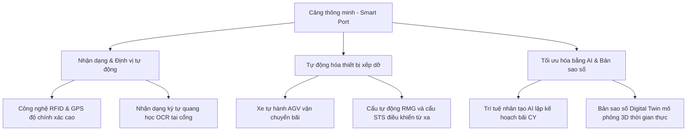

# TÀI LIỆU HƯỚNG DẪN TỰ HỌC (E-LEARNING 4)
## BUỔI 11: CÔNG NGHỆ CẢNG THÔNG MINH VÀ ĐO LƯỜNG HIỆU QUẢ DỊCH VỤ

* **Môn học:** Quản lý và Khai thác Ga, Cảng (Mã môn: 418009)
* **Giảng viên biên soạn:** ThS. Nguyễn Tuấn Hiệp
* **Đối tượng:** Sinh viên ngành Quản trị Logistics và Chuỗi cung ứng - Trường Đại học Giao thông Vận tải TP.HCM (UTH)

---

### GIỚI THIỆU BÀI HỌC
Chào các em sinh viên,
Bài học tự học trực tuyến **Buổi số 11 (E-learning 4)** sẽ hướng dẫn các em tiếp cận một trong những xu hướng quan trọng nhất của ngành khai thác ga cảng hiện đại: **Chuyển đổi số, Cảng thông minh (Smart Port)** và **Đo lường chất lượng dịch vụ cảng**. Sự ứng dụng của công nghệ 4.0 đang thay đổi hoàn toàn cách thức điều hành bến cảng, giúp tăng năng suất bốc dỡ và giảm thiểu thời gian tàu nằm bến.

Các em cần đọc kỹ tài liệu này để nắm được:
1. Vai trò của hệ thống TOS và PCS.
2. Các công nghệ cốt lõi cấu thành mô hình Cảng thông minh (RFID, AI, Digital Twin, AGV).
3. Các chỉ số đo lường hiệu suất (KPIs) của bến cảng.

Hãy hoàn thành bài đọc, sau đó truy cập Moodle để trả lời bộ 20 câu hỏi trắc nghiệm kiểm tra.

---

### PHẦN 1: HỆ THỐNG THÔNG TIN QUẢN LÝ VÀ ĐIỀU HÀNH CẢNG CỐT LÕI

Tại bất kỳ một cảng container hiện đại nào, dòng chảy thông tin (Information Flow) luôn đi trước dòng chảy vật chất của hàng hóa. Hai hệ thống phần mềm nền tảng quyết định hiệu quả điều hành gồm:

#### 1. Hệ thống điều hành cảng (Terminal Operating System - TOS)
* **Khái niệm:** Là hệ thống phần mềm chuyên dụng điều hành toàn bộ các tác nghiệp xếp dỡ, di chuyển và lưu trữ container trong phạm vi bến cảng.
* **Chức năng cốt lõi:**
  * **Lập kế hoạch tàu (Vessel Planning):** Xác định vị trí xếp các container trên tàu sao cho cân bằng trọng tải và tối ưu năng suất xếp dỡ.
  * **Lập kế hoạch bãi (Yard Planning):** Chỉ định vị trí hạ container trên bãi CY, tránh đảo chuyển nhiều lần.
  * **Điều phối thiết bị (Equipment Control):** Chỉ định công việc cho cẩu STS, cẩu bãi RTG/RMG và xe đầu kéo bãi chạy tối ưu nhất.
  * **Định vị container:** Theo dõi tọa độ vị trí chính xác (Bay-Row-Tier) của từng container theo thời gian thực.
* *Các hệ thống TOS nổi tiếng thế giới:* CATOS (Hàn Quốc), TOPS, Navis N4 (Mỹ).

#### 2. Hệ thống cộng đồng cảng (Port Community System - PCS)
* **Khái niệm:** Nền tảng chia sẻ thông tin điện tử kết nối tất cả các bên tham gia vào chuỗi cung ứng qua cảng.
* **Mục tiêu:** Trao đổi dữ liệu không dùng giấy tờ giữa cảng, hải quan, cơ quan biên phòng, hãng tàu, đại lý vận tải và doanh nghiệp logistics.
* *Ví dụ thực tế:* Cảng thông minh thường tích hợp trực tiếp PCS với hệ thống Một cửa quốc gia (National Single Window) giúp thông quan tự động hóa.

---

### PHẦN 2: CÁC CÔNG NGHỆ CỦA CẢNG THÔNG MINH (SMART PORT)

Cảng thông minh (Smart Port) là mô hình bến cảng sử dụng công nghệ số để tự động hóa, tối ưu hóa các quy trình vận hành và nâng cao tính bền vững. Các công nghệ cốt lõi gồm:

* **Digital Twin (Bản sao số):** Tạo ra một bản sao kỹ thuật số 3D của cảng biển kết nối với dữ liệu cảm biến thời gian thực. Giúp người quản trị mô phỏng các tình huống ùn tắc, giả định phương án giải phóng tàu nhanh mà không cần thử nghiệm trên thực địa.
* **AGV (Automated Guided Vehicle):** Xe tự hành không người lái vận chuyển container giữa cầu tàu và bãi, chạy bằng điện năng giúp bảo vệ môi trường (Green Port).

---

### PHẦN 3: ĐO LƯỜNG HIỆU SUẤT VÀ CHẤT LƯỢNG DỊCH VỤ CẢNG

Để đánh giá năng lực cạnh tranh và chất lượng dịch vụ cảng, các chỉ số hiệu suất chính (KPIs) được áp dụng:

#### 1. Năng suất cẩu bờ (Crane Productivity)
* **Khái niệm:** Số container bốc dỡ được trên mỗi cẩu bờ STS trong 1 giờ.
* **Đơn vị tính:** Moves/hour (số lần bốc dỡ/giờ).
* **Ý nghĩa:** Chỉ số quan trọng phản ánh tốc độ kỹ thuật trực tiếp phục vụ giải phóng tàu. Cảng hiện đại thường đạt năng suất trên 30 moves/giờ/cẩu.

#### 2. Thời gian giải phóng tàu (Vessel Turnaround Time)
* **Khái niệm:** Tổng thời gian từ khi tàu cập cảng, xếp dỡ hàng hóa xong, làm thủ tục hải quan và rời khỏi cảng.
* **Ý nghĩa:** Hãng tàu luôn muốn thời gian này ngắn nhất có thể vì chi phí thuê tàu mỗi ngày cực kỳ đắt đỏ.

#### 3. Thời gian xe tải nằm cảng (Truck Turnaround Time)
* **Khái niệm:** Thời gian từ lúc xe tải chở container đi qua cổng cảng vào giao nhận hàng đến khi hoàn thành tác nghiệp và đi qua cổng ra.
* **Ý nghĩa:** Phản ánh năng lực điều phối của bãi chứa và cổng cảng đối với phương tiện hậu phương. Thời gian tiêu chuẩn thường dưới 45-60 phút.

---

### CÂU HỎI TỰ LUYỆN
1. Phân biệt sự khác nhau về phạm vi và đối tượng phục vụ giữa hệ thống TOS (Terminal Operating System) và hệ thống PCS (Port Community System).
2. Hãy lấy ví dụ về một chỉ số chất lượng dịch vụ cảng bị ảnh hưởng trực tiếp nếu cẩu bãi RTG bị hỏng hóc thường xuyên.

---

### TÀI LIỆU THAM KHẢO
1. ESCAP national strategies for smart port development in Asia-Pacific.
2. UNCTAD Port Performance Indicators guidelines (2024).

---
### TÀI LIỆU ĐỌC THÊM THỰC TẾ (REFERENCES)
Các tài liệu thực tiễn dưới đây nằm trong thư mục  để phục vụ đối chiếu thực tiễn:
* [Quyết định 442/QĐ-TTg năm 2024 về Điều chỉnh Quy hoạch Cảng biển Việt Nam](../../Slides%20gia%CC%89ng%20da%CC%A3y/Tai%20lieu%20tham%20khao%20th%E1%BB%B1c%20t%E1%BA%BF/Van%20ban%20phap%20ly%20&%20Quy%20hoach/Quyet%20dinh%20442%20QD-TTg%20Dieu%20chinh%20Quy%20hoach%20Cang%20bien.txt)
* [Báo cáo dự án Cảng trung chuyển quốc tế Cần Giờ](../../Slides%20gia%CC%89ng%20da%CC%A3y/Tai%20lieu%20tham%20khao%20th%E1%BB%B1c%20t%E1%BA%BF/Bao%20cao%20thuc%20tien%20&%20Du%20an/Thong%20tin%20Du%20an%20Cang%20trung%20chuyen%20quoc%20te%20Can%20Gio.txt)
