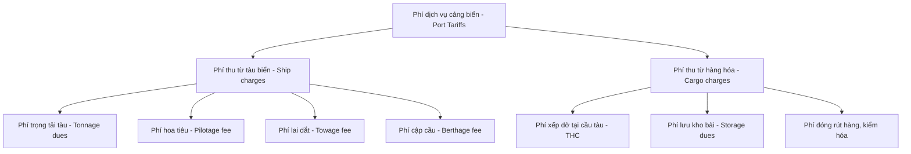

# TÀI LIỆU HƯỚNG DẪN TỰ HỌC (E-LEARNING 5)
## BUỔI 13: MARKETING, CẠNH TRANH VÀ ĐỊNH GIÁ DỊCH VỤ CẢNG

* **Môn học:** Quản lý và Khai thác Ga, Cảng (Mã môn: 418009)
* **Giảng viên biên soạn:** ThS. Nguyễn Tuấn Hiệp
* **Đối tượng:** Sinh viên ngành Quản trị Logistics và Chuỗi cung ứng - Trường Đại học Giao thông Vận tải TP.HCM (UTH)

---

### GIỚI THIỆU BÀI HỌC
Chào các em sinh viên,
Bài học tự học trực tuyến **Buổi số 13 (E-learning 5)** sẽ giúp các em nghiên cứu khía cạnh kinh tế và thương mại của quản trị cảng biển: **Marketing cảng**, **Cạnh tranh cảng biển (Port Competition)** và **Định giá dịch vụ cảng (Port Pricing)**. Đây là những nội dung rất quan trọng giúp các nhà quản trị cảng thu hút hãng tàu, giành thị phần và tối đa hóa doanh thu khai thác.

Các em cần đọc kỹ tài liệu này để nắm vững:
1. Bản chất cạnh tranh cảng biển (Intra-port vs. Inter-port).
2. Các yếu tố quyết định năng lực cạnh tranh cảng.
3. Cơ cấu các loại phí dịch vụ cảng biển và phương pháp định giá.

Sau khi đọc xong tài liệu, các em hãy truy cập hệ thống Moodle để làm bộ 20 câu hỏi trắc nghiệm ôn tập.

---

### PHẦN 1: MARKETING CẢNG BIỂN VÀ XÂY DỰNG THƯƠNG HIỆU

Marketing cảng không đơn thuần là quảng cáo, mà là chuỗi các hoạt động nghiên cứu thị trường, nâng cao chất lượng dịch vụ nhằm thu hút và giữ chân khách hàng (chủ yếu là các hãng tàu và chủ hàng lớn).

#### 1. Khách hàng mục tiêu của Marketing cảng
* **Các hãng tàu (Ocean Carriers):** Đặc biệt là các liên minh hãng tàu lớn toàn cầu (như Ocean Alliance, THE Alliance, 2M). Quyết định lựa chọn cảng của hãng tàu ảnh hưởng trực tiếp đến sản lượng thông qua của cảng.
* **Chủ hàng (Shippers):** Các nhà xuất nhập khẩu lớn quyết định luồng hàng dịch chuyển qua cảng.
* **Các công ty Logistics / Forwarders:** Các bên trung gian lựa chọn tuyến đường vận chuyển tối ưu cho khách hàng.

#### 2. Xây dựng thương hiệu cảng
Thương hiệu của một cảng biển được định hình bởi:
* **Độ tin cậy và an toàn:** Ít xảy ra sự cố hư hỏng hàng hóa, tai nạn lao động hay đình công.
* **Thời gian giải phóng tàu nhanh:** Năng suất xếp dỡ cẩu bờ cao, giảm chi phí chờ bến cho hãng tàu.
* **Cảng xanh (Green Port):** Xu hướng ưu tiên các cảng giảm phát thải carbon và sử dụng năng lượng sạch (nhiều hãng tàu lớn bắt buộc chọn cảng đạt chứng chỉ xanh).

---

### PHẦN 2: CẠNH TRANH GIỮA CÁC CẢNG BIỂN (PORT COMPETITION)

Theo giáo trình Kinh tế cảng biển (Port Economics - Notteboom), cạnh tranh cảng biển được chia làm hai cấp độ cốt lõi:

#### 1. Cạnh tranh nội bộ cảng (Intra-port competition)
* **Khái niệm:** Là sự cạnh tranh giữa các doanh nghiệp khai thác bến cảng khác nhau trong cùng một khu vực cảng biển (cùng chia sẻ chung luồng hàng hải hậu cần).
* **Ví dụ thực tế:** Sự cạnh tranh giành hãng tàu giữa cảng Gemalink và cảng TCIT/TCTT tại khu vực Cái Mép - Thị Vải, hoặc cạnh tranh giữa cảng Tân Cảng Cát Lái và cảng SP-ITC tại TP.HCM.

#### 2. Cạnh tranh liên cảng (Inter-port competition)
* **Khái niệm:** Là sự cạnh tranh giữa các khu vực cảng biển khác nhau trong cùng một quốc gia hoặc giữa các quốc gia trong khu vực địa lý.
* **Ví dụ thực tế:** Cạnh tranh giữa cụm cảng Cái Mép - Thị Vải và cảng Singapore hoặc cảng Laem Chabang (Thái Lan) để thu hút hàng trung chuyển quốc tế.

---

### PHẦN 3: CƠ CẤU VÀ PHƯƠNG PHÁP ĐỊNH GIÁ DỊCH VỤ CẢNG

Định giá dịch vụ cảng (Port Pricing / Port Tariffs) là công cụ thương mại quan trọng để bù đắp chi phí đầu tư hạ tầng và tạo lợi thế cạnh tranh. Hệ thống phí cảng biển được chia thành hai nhóm chính:

#### 1. Phí thu từ tàu (Ship charges)
* Do hãng tàu chi trả dựa trên kích cỡ tàu (thường tính theo tổng dung tích tàu - Gross Tonnage (GT) hoặc mớn nước của tàu).
* Gồm phí trọng tải, phí hoa tiêu (bắt buộc tàu nước ngoài phải thuê hoa tiêu dẫn đường), phí lai dắt (thuê tàu kéo hỗ trợ cập bến), phí cầu tàu.

#### 2. Phí thu từ hàng hóa (Cargo charges)
* Do chủ hàng hoặc hãng tàu (phần phí xếp dỡ) chi trả.
* **Phí xếp dỡ container tại cầu tàu (Terminal Handling Charge - THC):** Chi phí bốc xếp container từ tàu xuống bãi hoặc ngược lại.
* **Phí lưu kho bãi (Storage dues):** Thu khi container lưu trữ tại bãi quá thời hạn miễn phí cho phép.

#### 3. Phương pháp định giá và quy định tại Việt Nam
* **Định giá dựa trên chi phí (Cost-based pricing):** Giá dịch vụ được tính bằng chi phí vận hành cộng thêm tỷ lệ lợi nhuận mong muốn.
* **Định giá dựa trên thị trường (Market-based pricing):** Định giá linh hoạt theo giá của các cảng đối thủ cạnh tranh nhằm thu hút khách hàng.
* *Quy định pháp lý tại Việt Nam:* Nhà nước (Bộ Giao thông Vận tải) ban hành **Thông tư quy định khung giá dịch vụ cảng biển** (áp đặt mức giá sàn tối thiểu và giá trần tối đa cho các dịch vụ bốc dỡ container, hoa tiêu, lai dắt) để tránh việc các cảng bán phá giá, cạnh tranh không lành mạnh dẫn đến thiệt hại kinh tế ngành.

---

### CÂU HỎI TỰ LUYỆN
1. Lấy ví dụ thực tế tại khu vực Cái Mép - Thị Vải hoặc Hải Phòng để minh họa cho hai khái niệm: Cạnh tranh nội bộ cảng (Intra-port) và Cạnh tranh liên cảng (Inter-port).
2. Tại sao Bộ Giao thông Vận tải Việt Nam phải ban hành khung giá dịch vụ bốc dỡ container (áp dụng giá sàn) mà không để các doanh nghiệp cảng tự định giá hoàn toàn theo cơ chế thị trường tự do?

---

### TÀI LIỆU THAM KHẢO
1. Notteboom, T., Pallis, A. A., & Rodrigue, J.-P. (2026). Port Economics, Management and Policy. Routledge.
2. Thông tư số 39/2023/TT-BGTVT của Bộ Giao thông Vận tải quy định khung giá dịch vụ hoa tiêu, dịch vụ sử dụng cầu, bến, phao neo, dịch vụ bốc dỡ container và dịch vụ lai dắt tại cảng biển Việt Nam.

---
### TÀI LIỆU ĐỌC THÊM THỰC TẾ (REFERENCES)
Các tài liệu thực tiễn dưới đây nằm trong thư mục  để phục vụ đối chiếu thực tiễn:
* [Quyết định 442/QĐ-TTg năm 2024 về Điều chỉnh Quy hoạch Cảng biển Việt Nam](../../Slides%20gia%CC%89ng%20da%CC%A3y/Tai%20lieu%20tham%20khao%20th%E1%BB%B1c%20t%E1%BA%BF/Van%20ban%20phap%20ly%20&%20Quy%20hoach/Quyet%20dinh%20442%20QD-TTg%20Dieu%20chinh%20Quy%20hoach%20Cang%20bien.txt)
* [Báo cáo dự án Cảng trung chuyển quốc tế Cần Giờ](../../Slides%20gia%CC%89ng%20da%CC%A3y/Tai%20lieu%20tham%20khao%20th%E1%BB%B1c%20t%E1%BA%BF/Bao%20cao%20thuc%20tien%20&%20Du%20an/Thong%20tin%20Du%20an%20Cang%20trung%20chuyen%20quoc%20te%20Can%20Gio.txt)
