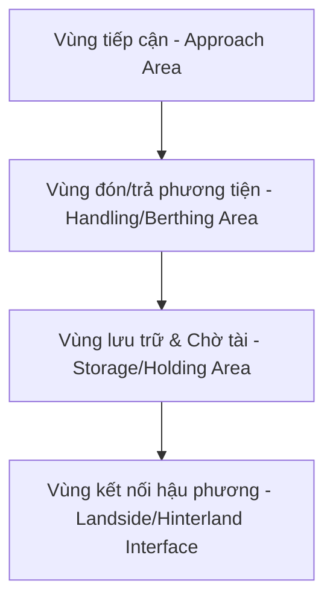

# TÀI LIỆU HƯỚNG DẪN TỰ HỌC (E-LEARNING 1)
## BUỔI 3: CẤU TRÚC VẬN HÀNH CHUNG CHO MỌI LOẠI HÌNH GA, CẢNG

* **Môn học:** Quản lý và Khai thác Ga, Cảng (Mã môn: 418009)
* **Giảng viên biên soạn:** ThS. Nguyễn Tuấn Hiệp
* **Đối tượng:** Sinh viên ngành Quản trị Logistics và Chuỗi cung ứng - Trường Đại học Giao thông Vận tải TP.HCM (UTH)

---

### GIỚI THIỆU BÀI HỌC
Chào các em sinh viên,
Buổi số 3 là bài học tự học (E-learning) đầu tiên trong chương trình học. Trong bài học này, chúng ta sẽ cùng nghiên cứu về **Cấu trúc vận hành chung áp dụng cho mọi loại hình ga, cảng** (bao gồm bến xe đường bộ, ga đường sắt, cảng hàng không và cảng biển) và các công thức kỹ thuật nền tảng để tính toán công suất khai thác của các phân khu chức năng tại đầu mối vận tải này.

Các em cần đọc kỹ tài liệu này, kết hợp với slide bài giảng để làm bài tập tự luyện và chuẩn bị cho bộ 20 câu hỏi trắc nghiệm kiểm tra trên hệ thống Moodle.

> **Lưu ý:** Nên mở tài liệu này trên **máy tính (laptop/PC)** thay vì điện thoại để bảng biểu, công thức và sơ đồ hiển thị đầy đủ và đẹp nhất.

---

### PHẦN 1: CẤU TRÚC VẬN HÀNH VÀ CƠ SỞ VẬT CHẤT CHUNG

Mặc dù các phương thức vận tải (đường bộ, đường sắt, hàng không, đường biển) có đặc thù kỹ thuật rất khác nhau, nhưng về mặt **quản lý khai thác ga cảng**, tất cả đều chia sẻ một cấu trúc vận hành chung gồm 4 khu vực chức năng cốt lõi:

1. **Vùng tiếp cận (Approach Area):** Là ranh giới kết nối giữa mạng lưới tuyến vận tải bên ngoài với ga cảng. Nhiệm vụ chính là dẫn đường và điều phối phương tiện đi vào/ra ga cảng an toàn.
2. **Vùng đón/trả phương tiện (Handling/Berthing Area):** Nơi thực hiện tác nghiệp xếp dỡ hàng hóa hoặc đón/trả hành khách trực tiếp từ phương tiện vận tải.
3. **Vùng lưu trữ & Chờ tài (Storage/Holding Area):** Nơi đỗ chờ của phương tiện trước/sau khi làm hàng (chờ tài) hoặc nơi lưu trữ tạm thời hàng hóa (kho, bãi) và hành khách (phòng chờ).
4. **Vùng kết nối hậu phương (Hinterland Interface/Landside):** Khu vực cổng kiểm soát (Gate), bãi trung chuyển, kết nối ga cảng với mạng lưới giao thông đường bộ đô thị hoặc khu vực hậu phương để phân phối hàng hóa/hành khách.

#### Bảng đối chiếu cơ sở vật chất tương ứng của 4 loại hình ga cảng:

| Khu vực chức năng | Bến xe khách (Đường bộ) | Ga đường sắt (Đường sắt) | Cảng hàng không (Hàng không) | Cảng biển (Đường biển) |
| :--- | :--- | :--- | :--- | :--- |
| **1. Vùng tiếp cận** | Đường nối từ trục chính đô thị vào bến xe | Các đường ray nhánh đi vào ga, hệ thống ghi | Đường cất - hạ cánh (Runway), tĩnh không | Luồng hàng hải, phao tiêu, khu neo đậu tàu |
| **2. Vùng đón/trả** | Vị trí đón/trả khách của xe (bến đỗ) | Ke ga (Platform), đường ray dừng đón trả khách | Vị trí đỗ tàu bay (Apron/Stand), cầu ống lồng | Cầu cảng (Berth), bến phao |
| **3. Vùng lưu trữ / Chờ** | Bãi đỗ xe chờ tài, nhà chờ cho hành khách | Bãi hàng (Yard), kho hàng (Warehouse), ga khách | Nhà ga hành khách (Terminal), kho hàng hóa | Bãi container (CY), kho CFS, kho ngoại quan |
| **4. Kết nối hậu phương** | Cổng kiểm soát (Gate), khu vực taxi/xe máy | Cổng ga, đường ô tô kết nối vào ga | Cổng sân bay, hệ thống đường bộ kết nối | Cổng cảng (Gate), bãi depot hậu phương |

---

### PHẦN 2: TÍNH TOÁN CÔNG SUẤT KHU VỰC ĐÓN/TRẢ PHƯƠNG TIỆN

#### 1. Công suất khai thác của bến xe trong một giờ
Công suất khai thác thực tế của khu vực đón/trả phương tiện bị ảnh hưởng lớn bởi khả năng thông hành của mạng lưới đường giao thông xung quanh bến xe (đường tiếp cận).

**Công thức:**
$$B_{\text{khai thác/giờ}} = \varphi \times B_{\text{tính toán}}$$

Trong đó:
* $B_{\text{khai thác/giờ}}$: Công suất khai thác thực tế của bến xe trong một giờ (xe/giờ).
* $B_{\text{tính toán}}$: Công suất tính toán lý thuyết của bến xe trong một giờ (xe/giờ), xác định dựa trên số vị trí đón/trả khách hiện có và thời gian dãn cách tối thiểu giữa các chuyến:
  $$B_{\text{tính toán}} = N \times \frac{60}{t_{\text{headway}}}$$
  *(với $N$ là số vị trí đón/trả và $t_{\text{headway}}$ là thời gian dãn cách trung bình giữa các chuyến tính bằng phút).*
* $\varphi$: Hệ số ảnh hưởng đến công suất bến xe (đánh giá mức độ phục vụ của đường giao thông xung quanh bến xe). Hệ số này phụ thuộc vào tỷ số $V/C$ (Lưu lượng giao thông thực tế của đường tiếp cận / Khả năng thông hành thiết kế của đường tiếp cận).

#### Bảng tra hệ số ảnh hưởng $\varphi$ theo tỷ số V/C:
| Tỷ số V/C (Volume/Capacity) | Dưới 60% | 60% - 69% | 70% - 79% | 80% - 89% | 90% - 100% | Trên 100% |
| :---: | :---: | :---: | :---: | :---: | :---: | :---: |
| **Hệ số ảnh hưởng $\varphi$** | 1,00 | 0,95 | 0,90 | 0,85 | 0,80 | 0,75 |

#### 2. Công suất bến xe trong ngày
**Công thức:**
$$B_{\text{ngày}} = T \times B_{\text{khai thác/giờ}}$$

Trong đó:
* $B_{\text{ngày}}$: Công suất bến xe trong ngày (xe/ngày).
* $T$: Thời gian hoạt động của bến xe trong ngày (giờ/ngày).

---

#### HƯỚNG DẪN GIẢI CÁC VÍ DỤ ỨNG DỤNG (PHẦN 2)

##### Ví dụ 1:
Một bến xe hoạt động từ 4h đến 21h hàng ngày. Khu vực đón trả khách có 3 vị trí, thời gian dãn cách trung bình giữa các chuyến xe là 5 phút/chuyến. Khảo sát đường tiếp cận vào bến có hệ số sử dụng khả năng thông hành (V/C) là 0,45 (45%). Xác định công suất bến xe trong ngày?

**Bài giải chi tiết:**
1. **Thời gian hoạt động trong ngày ($T$):**
   $$T = 21 - 4 = 17 \text{ giờ/ngày}$$
2. **Công suất tính toán lý thuyết trong một giờ ($B_{\text{tính toán}}$):**
   $$B_{\text{tính toán}} = N \times \frac{60}{t_{\text{headway}}} = 3 \times \frac{60}{5} = 36 \text{ xe/giờ}$$
3. **Xác định hệ số ảnh hưởng $\varphi$:**
   Tỷ số $V/C = 0,45 = 45\% < 60\%$. Tra bảng, ta có: $\varphi = 1,00$.
4. **Công suất khai thác thực tế trong một giờ ($B_{\text{khai thác/giờ}}$):**
   $$B_{\text{khai thác/giờ}} = \varphi \times B_{\text{tính toán}} = 1,00 \times 36 = 36 \text{ xe/giờ}$$
5. **Công suất bến xe trong ngày ($B_{\text{ngày}}$):**
   $$B_{\text{ngày}} = T \times B_{\text{khai thác/giờ}} = 17 \times 36 = 612 \text{ xe/ngày}$$
   
*Đáp số:* **612 xe/ngày**.

---

##### Ví dụ Tự học (Ví dụ TH):
Một bến xe hoạt động từ 4h đến 22h hàng ngày. Khu vực đón trả khách có 3 vị trí, thời gian dãn cách trung bình giữa các chuyến xe là 15 phút/chuyến. Khảo sát đường tiếp cận vào bến có hệ số sử dụng khả năng thông hành (V/C) là 0,75 (75%). Xác định công suất bến xe trong ngày?

**Bài giải chi tiết:**
1. **Thời gian hoạt động trong ngày ($T$):**
   $$T = 22 - 4 = 18 \text{ giờ/ngày}$$
2. **Công suất tính toán lý thuyết trong một giờ ($B_{\text{tính toán}}$):**
   $$B_{\text{tính toán}} = N \times \frac{60}{t_{\text{headway}}} = 3 \times \frac{60}{15} = 12 \text{ xe/giờ}$$
3. **Xác định hệ số ảnh hưởng $\varphi$:**
   Tỷ số $V/C = 0,75 = 75\%$ (nằm trong khoảng 70% - 79%). Tra bảng, ta có: $\varphi = 0,90$.
4. **Công suất khai thác thực tế trong một giờ ($B_{\text{khai thác/giờ}}$):**
   $$B_{\text{khai thác/giờ}} = \varphi \times B_{\text{tính toán}} = 0,90 \times 12 = 10,8 \text{ xe/giờ}$$
5. **Công suất bến xe trong ngày ($B_{\text{ngày}}$):**
   $$B_{\text{ngày}} = T \times B_{\text{khai thác/giờ}} = 18 \times 10,8 = 194,4 \text{ xe/ngày}$$
   *Lưu ý thực tế:* Do số xe phải là số nguyên, công suất khai thác thực tế của bến xe sẽ được làm tròn xuống là **194 xe/ngày**.

*Đáp số:* **194,4 xe/ngày (hoặc 194 xe/ngày)**.

---

### PHẦN 3: TÍNH TOÁN CÔNG SUẤT TỐI ĐA KHU VỰC ĐÓN/TRẢ KÈM THEO DIỆN TÍCH

Trong trường hợp muốn tính toán công suất tối đa của phân khu đón (trả) khách dựa trên diện tích hiện có của phân khu này tại ga bến, chúng ta áp dụng quy trình tính như sau:

#### 1. Xác định số vị trí đón (trả) khách tối đa có thể bố trí ($N$)
$$N = \left\lfloor \frac{S}{S_b} \right\rfloor$$

Trong đó:
* $S$: Diện tích bến xe dành cho việc đón (trả) khách ($m^2$).
* $S_b$: Diện tích bình quân tối thiểu cần có cho một vị trí đón (trả) khách ($m^2$).
* Ký hiệu $\lfloor \dots \rfloor$ là phép toán làm tròn xuống lấy phần nguyên (do số vị trí đỗ xe phải là số nguyên dương).

#### 2. Công suất đón/trả khách tối đa trong một giờ hoạt động ($B_{tk}$)
$$B_{tk} = \frac{60 \times N}{t_c + t_d \times (1 + Z \times c_v)}$$

Trong đó:
* $B_{tk}$: Công suất đón hoặc trả khách tối đa của phân khu trong một giờ (xe/giờ).
* $N$: Số vị trí đón (trả) khách (vị trí).
* $t_c$: Thời gian trống cần thiết giữa hai xe liên tiếp ra vào vị trí đỗ (phút).
* $t_d$: Thời gian dừng của xe tại vị trí để thực hiện tác nghiệp đón hoặc trả khách (phút).
* $c_v$: Hệ số biến động thời gian dừng đỗ của phương tiện (thường lấy mặc định bằng 1,00).
* $Z$: Hệ số điều chỉnh thời gian dừng đỗ do ảnh hưởng của dòng xe chờ phía sau (thường lấy mặc định bằng 1,00).

---

#### HƯỚNG DẪN GIẢI CÁC VÍ DỤ ỨNG DỤNG (PHẦN 3)

##### Ví dụ 2:
Một bến xe khách có diện tích dành riêng cho việc trả khách là $S = 140\ m^2$. Diện tích định mức cho một vị trí trả khách là $S_b = 40\ m^2/vị\ trí$. Thời gian trống giữa hai xe liên tiếp là $t_c = 1,5$ phút. Thời gian dừng trả khách trung bình của một xe là $t_d = 1$ phút. Giả thiết hệ số biến động $c_v = 1$ và hệ số điều chỉnh hàng chờ $Z = 1$. Hãy xác định công suất trả khách tối đa của bến xe trong một giờ hoạt động?

**Bài giải chi tiết:**
1. **Xác định số vị trí trả khách tối đa ($N$):**
   $$N = \left\lfloor \frac{S}{S_b} \right\rfloor = \left\lfloor \frac{140}{40} \right\rfloor = \lfloor 3,5 \rfloor = 3 \text{ vị trí}$$
2. **Tính công suất tối đa khu vực trả khách trong 1 giờ ($B_{tk}$):**
   $$B_{tk} = \frac{60 \times N}{t_c + t_d \times (1 + Z \times c_v)} = \frac{60 \times 3}{1,5 + 1 \times (1 + 1 \times 1)} = \frac{180}{1,5 + 2} = \frac{180}{3,5} \approx 51,4 \text{ xe/giờ}$$
   Làm tròn thực tế: **51 xe/giờ**.

*Đáp số:* **51 xe/giờ**.

---

##### Ví dụ 2 Tự học (Ví dụ 2 TH):
Một bến xe có diện tích dành riêng cho việc trả khách là $S = 500\ m^2$. Diện tích định mức cho một vị trí trả khách là $S_b = 40\ m^2/vị\ trí$. Thời gian trống giữa hai xe liên tiếp là $t_c = 5$ phút. Thời gian dừng trả khách trung bình của một xe là $t_d = 10$ phút. Giả thiết hệ số biến động $c_v = 1$ và hệ số điều chỉnh hàng chờ $Z = 1$. Xác định công suất trả khách tối đa của khu vực này trong một giờ?

**Bài giải chi tiết:**
1. **Xác định số vị trí trả khách tối đa ($N$):**
   $$N = \left\lfloor \frac{S}{S_b} \right\rfloor = \left\lfloor \frac{500}{40} \right\rfloor = \lfloor 12,5 \rfloor = 12 \text{ vị trí}$$
2. **Tính công suất tối đa khu vực trả khách trong 1 giờ ($B_{tk}$):**
   $$B_{tk} = \frac{60 \times N}{t_c + t_d \times (1 + Z \times c_v)} = \frac{60 \times 12}{5 + 10 \times (1 + 1 \times 1)} = \frac{720}{5 + 20} = \frac{720}{25} = 28,8 \text{ xe/giờ}$$
   Làm tròn thực tế: **28 xe/giờ** (hoặc 28,8 xe/giờ).

*Đáp số:* **28,8 xe/giờ**.

---

### PHẦN 4: TÍNH TOÁN CÔNG SUẤT KHU VỰC CHỜ TÀI (HOLDING AREA)

Khu vực chờ tài (hoặc khu vực đỗ chờ của phương tiện trước khi xếp dỡ/làm hàng) có vai trò như một bộ đệm giảm tải cho khu vực đón trả khách chính. Công suất chung của khu vực chờ tài là tổng công suất của các vị trí đỗ xe chờ tài thuộc các tuyến đang hoạt động.

**Công thức tổng quát:**
$$B_{ct} = \sum_{i=1}^{m} \frac{60 \times n_i}{t_{ct,i}}$$

Trong đó:
* $B_{ct}$: Công suất của khu vực chờ tài toàn bến (xe/giờ).
* $m$: Tổng số tuyến xe đang hoạt động tại bến.
* $n_i$: Số vị trí đỗ chờ tài của tuyến thứ $i$ (vị trí).
* $t_{ct,i}$: Thời gian đỗ chờ tài trung bình của phương tiện thuộc tuyến thứ $i$ (phút).

Nếu tất cả các tuyến có số vị trí chờ tài và thời gian chờ tài giống nhau ($n_i = n_t$ và $t_{ct,i} = t_{ct}$), công thức đơn giản hóa thành:
$$B_{ct} = m \times \frac{60 \times n_t}{t_{ct}}$$

---

#### HƯỚNG DẪN GIẢI VÍ DỤ ỨNG DỤNG (PHẦN 4)

##### Ví dụ 3:
Một bến xe buýt hiện tại đang điều phối 4 tuyến xe buýt hoạt động tại bến. Giới hạn mỗi tuyến xe buýt được phân bổ tối đa $n_t = 4$ vị trí đỗ chờ tài tại bến. Thời gian đỗ chờ tài trung bình của mỗi phương tiện trước khi vào vị trí đón khách là $t_{ct} = 10$ phút. Xác định công suất khai thác của khu vực chờ tài tại bến xe buýt này?

**Bài giải chi tiết:**
* Số tuyến xe buýt hoạt động ($m$): 4 tuyến.
* Số vị trí chờ tài phân bổ cho mỗi tuyến ($n_t$): 4 vị trí.
* Thời gian chờ tài trung bình ($t_{ct}$): 10 phút.
* Áp dụng công thức đơn giản hóa:
  $$B_{ct} = m \times \frac{60 \times n_t}{t_{ct}} = 4 \times \frac{60 \times 4}{10} = 4 \times 24 = 96 \text{ xe/giờ}$$

*Đáp số:* **96 xe/giờ**.

---

### HƯỚNG DẪN TỰ HỌC VÀ LƯU Ý CHO SINH VIÊN
1. **Lý thuyết:** Hãy liên hệ cấu trúc vận hành chung (4 vùng chức năng) với thực tế khi các em đi Sân bay Tân Sơn Nhất hoặc Bến xe Miền Đông/Miền Tây. Các phân khu đó được bố trí thế nào? Có xảy ra hiện tượng nghẽn cổ chai (bottleneck) ở vùng tiếp cận hay hậu phương không?
2. **Bài tập tính toán:**
   * Hãy ghi nhớ bảng tra hệ số ảnh hưởng $\varphi$ theo tỷ số V/C. Khi tỷ số V/C càng tăng (đường tiếp cận càng ùn tắc) thì hệ số $\varphi$ càng giảm (làm giảm công suất thực tế của bến xe).
   * Chú ý đơn vị tính thời gian luôn được quy đổi ra phút khi tính mẫu số, nhưng nhân tử số với $60$ để chuyển đổi năng suất về đơn vị **xe/giờ**.
   * Số vị trí đỗ xe ($N$) bắt buộc phải làm tròn xuống lấy số nguyên nguyên bản ($\lfloor \dots \rfloor$), không được làm tròn lên kể cả là $3,99$ hay $12,5$ vị trí.

Chúc các em hoàn thành tốt nội dung tự học Buổi 3!

---
### TÀI LIỆU ĐỌC THÊM THỰC TẾ (REFERENCES)
Các tài liệu thực tiễn dưới đây nằm trong thư mục  để phục vụ đối chiếu thực tiễn:
* [Quyết định 442/QĐ-TTg năm 2024 về Điều chỉnh Quy hoạch Cảng biển Việt Nam](../../Slides%20gia%CC%89ng%20da%CC%A3y/Tai%20lieu%20tham%20khao%20th%E1%BB%B1c%20t%E1%BA%BF/Van%20ban%20phap%20ly%20&%20Quy%20hoach/Quyet%20dinh%20442%20QD-TTg%20Dieu%20chinh%20Quy%20hoach%20Cang%20bien.txt)
* [Báo cáo dự án Cảng trung chuyển quốc tế Cần Giờ](../../Slides%20gia%CC%89ng%20da%CC%A3y/Tai%20lieu%20tham%20khao%20th%E1%BB%B1c%20t%E1%BA%BF/Bao%20cao%20thuc%20tien%20&%20Du%20an/Thong%20tin%20Du%20an%20Cang%20trung%20chuyen%20quoc%20te%20Can%20Gio.txt)
