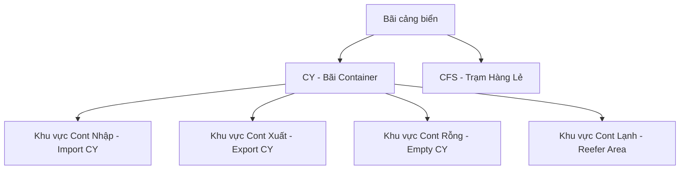
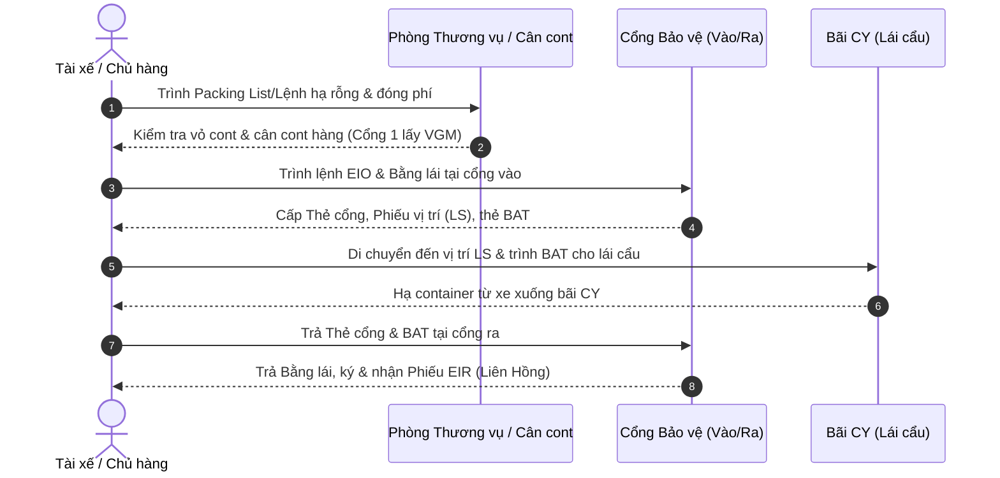

# TÀI LIỆU HƯỚNG DẪN TỰ HỌC (E-LEARNING 3)
## BUỔI 9: KHAI THÁC BÃI VÀ ĐIỀU PHỐI CỔNG CẢNG

* **Môn học:** Quản lý và Khai thác Ga, Cảng (Mã môn: 418009)
* **Giảng viên biên soạn:** ThS. Nguyễn Tuấn Hiệp
* **Đối tượng:** Sinh viên ngành Quản trị Logistics và Chuỗi cung ứng - Trường Đại học Giao thông Vận tải TP.HCM (UTH)

---

### GIỚI THIỆU BÀI HỌC
Chào các em sinh viên,
Nội dung tự học của **Buổi số 9 (E-learning 3)** sẽ giúp các em tìm hiểu về hai khu vực tác nghiệp vô cùng quan trọng tại đầu mối cảng biển: **Khu vực bãi chứa (Yard)** và **Khu vực cổng cảng (Gate)**. Đây là những mắt xích chịu trách nhiệm lưu trữ tạm thời hàng hóa và kết nối trực tiếp với dòng phương tiện vận tải hậu phương (đường bộ).

Các em cần nghiên cứu kỹ tài liệu này để nắm vững:
1. Phân loại bãi cảng (CY, CFS).
2. Các công thức toán học tính dung lượng và diện tích bãi cần thiết.
3. Nguyên lý hoạt động của các thiết bị xếp dỡ bãi (RTG, RMG, Reach Stacker).
4. Quy trình tác nghiệp tại cổng cảng và giải pháp điều phối chống ùn tắc.

Sau khi đọc xong tài liệu, các em hãy thực hiện bộ 20 câu hỏi trắc nghiệm ôn tập trên hệ thống Moodle.

---

### PHẦN 1: PHÂN LOẠI BÃI CHỨA TẠI CẢNG BIỂN

Bãi cảng là khu vực thực hiện chức năng tích tụ, phân tải hàng hóa, lưu trữ tạm thời phục vụ xếp lên tàu hoặc giao nhận hậu phương. Đối với cảng container, bãi chứa được chia làm hai loại hình cốt lõi:

#### 1. Bãi container (Container Yard - CY)
* **Khái niệm:** Là khu vực trong cảng dùng để chứa các container chứa đầy hàng (FCL) hoặc container rỗng (Empty) trước khi xếp lên tàu xuất khẩu hoặc sau khi dỡ từ tàu nhập khẩu xuống.
* **Đặc điểm:** Chiếm phần lớn diện tích của cảng, được phân chia thành các ô/block container tiêu chuẩn.

#### 2. Trạm giao nhận hàng lẻ (Container Freight Station - CFS)
* **Khái niệm:** Là khu vực nhà kho chuyên dụng dùng để thu gom hàng lẻ (LCL) từ nhiều chủ hàng khác nhau đóng chung vào một container, hoặc ngược lại, dỡ hàng lẻ từ container ra để giao cho nhiều người nhận hàng khác nhau.
* **Đặc điểm:** Tác nghiệp chủ yếu diễn ra trong kho kín, sử dụng xe nâng nhỏ (Forklift) và thủ công để đóng/rút hàng.



---

### PHẦN 2: TÍNH TOÁN NĂNG LỰC VÀ DIỆN TÍCH BÃI CHỨA CONTAINER

Để thiết kế hoặc đánh giá hiệu quả bãi cảng, nhà quản trị cần tính toán dung lượng bãi chứa ($E_{CY}$) và diện tích bãi cần thiết ($A_{CY}$).

#### 1. Tính toán dung lượng bãi chứa ($E_{CY}$ - TEU)
Dung lượng bãi chứa biểu thị số lượng container tối đa (tính bằng TEU) cần lưu trữ tại bãi ở một thời điểm thiết kế:

$$E_{CY} = \frac{Q_{tq} \times t_l \times k_k}{365}$$

Trong đó:
* $Q_{tq}$: Sản lượng container thông qua cảng trong năm (TEU/năm).
* $t_l$: Thời gian lưu bãi trung bình của một container (ngày). (Ví dụ: cont nhập thường lưu 5-7 ngày, cont xuất lưu 3-4 ngày).
* $k_k$: Hệ số không đồng đều của lượng hàng hóa đến cảng (thường lấy $k_k \approx 1,1 - 1,25$).

#### 2. Tính toán diện tích bãi cần thiết ($A_{CY}$ - $m^2$)
Từ dung lượng chứa $E_{CY}$, diện tích mặt bằng bãi thực tế được tính bằng công thức:

$$A_{CY} = \frac{E_{CY} \times F_{xd} \times F_{sub}}{h_c \times \eta_{use}}$$

Trong đó:
* $F_{xd}$: Diện tích chiếm dụng hình chiếu bằng của 1 TEU (tiêu chuẩn $F_{xd} \approx 15 \, m^2$ bao gồm cả khe hở an toàn).
* $h_c$: Chiều cao xếp chồng container trung bình thực tế tại bãi (tùy thuộc thiết bị xếp dỡ, thường từ 3 đến 5 tầng).
* $F_{sub}$: Hệ số phụ trợ tính đến diện tích đường đi cho thiết bị bãi, văn phòng, nhà xưởng (thường từ $1,4$ đến $1,8$).
* $\eta_{use}$: Hệ số sử dụng dung lượng tối đa của bãi để tránh bị nghẽn (thường khống chế $\eta_{use} \approx 0,7 - 0,8$). Nếu bãi vượt quá 80% công suất thiết kế, hiệu quả vận hành sẽ giảm mạnh do phát sinh đảo chuyển container.

---

### PHẦN 3: THIẾT BỊ XẾP DỠ TẠI BÃI CONTAINER (YARD EQUIPMENT)

Việc lựa chọn thiết bị bãi ảnh hưởng trực tiếp đến mật độ xếp chồng (chiều cao $h_c$) và diện tích phụ trợ ($F_{sub}$). Ba loại thiết bị bãi phổ biến nhất gồm:

| Chỉ tiêu so sánh | Cẩu giàn bãi chạy ray (RMG) | Cẩu giàn bãi chạy bánh lốp (RTG) | Xe nâng container (Reach Stacker) |
|---|---|---|---|
| **Chiều cao xếp chồng** | 5 - 6 tầng container | 3 - 4 tầng container | 3 - 5 tầng container |
| **Độ rộng block xếp** | 12 - 14 hàng ngang | 6 - 8 hàng ngang | Chỉ với tới hàng thứ 1 hoặc 2 |
| **Tính linh hoạt** | Rất thấp (chạy trên ray cố định) | Trung bình (có thể chuyển block chậm) | Rất cao (chạy tự do trên bãi) |
| **Mức độ tự động hóa** | Rất cao | Trung bình | Thấp |
| **Chi phí đầu tư** | Rất cao | Cao | Thấp |

* **Lưu ý tác nghiệp:** Cẩu RMG phù hợp với cảng biển quy mô lớn cần mật độ chứa rất cao và tự động hóa; cẩu RTG là phổ biến nhất ở Việt Nam (như cảng Cát Lái, Cái Mép); xe nâng Reach Stacker phù hợp với cảng sông, cảng nhỏ hoặc bãi ICD vệ tinh.

---

### PHẦN 4: ĐIỀU PHỐI CỔNG CẢNG (GATE OPERATIONS)

Cổng cảng (Port Gate) đóng vai trò là "nút cổ chai" kết nối giao thông đường bộ hậu phương với khu vực lưu trữ bãi.

#### 1. Quy trình tác nghiệp tại cổng cảng
Khi xe đầu kéo chở container ra/vào cảng, quy trình tác nghiệp bao gồm:
1. **Kiểm tra chứng từ:** Kiểm tra số container, số seal, lệnh giao nhận (EIR) đã được thanh toán qua cổng thông tin E-port hay chưa.
2. **Kiểm tra ngoại quan:** Ghi nhận tình trạng vỏ container (bị móp méo, rách vỏ, rỉ sét...) để phân định trách nhiệm hư hỏng giữa hãng tàu, lái xe và cảng.
3. **Phân làn và chỉ định vị trí:** Chỉ định block và hàng cụ thể trên bãi để xe di chuyển vào hạ container hoặc nhận container lên xe.

#### 2. Vấn đề ùn tắc cổng cảng và giải pháp
* **Nguyên nhân:** Lượng xe tải đổ dồn vào cảng vào các khung giờ cố định (ví dụ: chiều tối hoặc trước giờ đóng sổ tàu - closing time), kết hợp thời gian làm thủ tục tại bốt kiểm soát thủ công kéo dài.
* **Giải pháp công nghệ hiện đại:**
  * **Smart Gate (Cổng thông minh):** Sử dụng camera nhận dạng ký tự quang học (OCR) tự động quét biển số xe, số container; sử dụng cổng cân tự động (WIM) để rút ngắn thời gian làm thủ tục xuống dưới 30 giây/xe.
  * **Hệ thống hẹn giờ Gate Appointment System (TAS):** Cảng yêu cầu các công ty vận tải đăng ký trước khung giờ mang xe đến giao nhận container. Hệ thống chỉ cho phép một lượng xe giới hạn vào cảng trong mỗi khung giờ, giúp kéo giãn đỉnh ùn tắc.

---

### PHẦN 5: QUY TRÌNH THỰC TẾ TẠI CẢNG CONTAINER QUỐC TẾ SP-ITC

Để giúp các em liên hệ lý thuyết với thực tế vận hành tại các cảng biển hiện đại ở Việt Nam, dưới đây là chi tiết các quy trình giao nhận container tại cổng (Gate) và quy trình đóng rút hàng tại kho CFS của **Cảng Container Quốc tế SP-ITC** (Quận 9, TP.HCM) – một trong những cảng container năng động áp dụng giải pháp cảng điện tử hiện đại.

#### 1. Quy trình giao nhận container tại Cổng cảng (SOP Gate)

##### a) Quy trình nhận container từ Cảng về (Container Pick-up Process)
Áp dụng cho khách hàng đến cảng nhận container hàng nhập khẩu hoặc nhận container rỗng về đóng hàng xuất khẩu. Quy trình gồm các bước:
1. **Làm thủ tục tại Thương vụ:** Khách hàng/tài xế đỗ xe tại bãi chờ, đến phòng Thương vụ xuất trình Booking/Lệnh giao container, đóng phí dịch vụ, nhận hóa đơn VAT và Lệnh Giao nhận (EIO) (nếu chưa làm lệnh điện tử E-port).
2. **Kiểm tra tại bốt bảo vệ cổng vào:** Tài xế xuất trình Bằng lái/CMND, trình lệnh EIO để nhân viên cổng khai báo số xe/rơ-moóc lên hệ thống. Tài xế nhận lại EIO, nhận Thẻ vào cổng, Phiếu vị trí bãi (LS) và tấm thẻ cẩu bãi (BAT).
3. **Tác nghiệp tại bãi container (CY):** Tài xế lái xe vào đúng vị trí chỉ định trên Phiếu LS, trình thẻ BAT cho nhân viên lái cẩu bãi (RTG, Reach Stacker hoặc Empty Handler) để gắp container lên xe.
4. **Làm thủ tục tại cổng ra:** Tài xế lái xe ra cổng, trả lại Thẻ vào cổng và BAT cho bảo vệ, nộp liên xanh của Lệnh giao nhận EIR, nhận lại Bằng lái/CMND và ký nhận Phiếu EIR (Liên Hồng).

```mermaid
sequenceDiagram
    autonumber
    actor TX as Tài xế / Chủ hàng
    participant TV as Phòng Thương vụ
    participant C as Cổng Bảo vệ (Vào/Ra)
    participant B as Bãi CY (Lái cẩu)

    TX->>TV: Trình lệnh giao cont/Booking & đóng phí
    TV-->>TX: Cấp hóa đơn VAT & Lệnh giao nhận (EIO)
    TX->>C: Xuất trình Bằng lái & lệnh EIO tại cổng vào
    C-->>TX: Khai báo số xe, cấp Thẻ cổng, Phiếu vị trí (LS), thẻ BAT
    TX->>B: Di chuyển đến vị trí LS & trình thẻ BAT cho lái cẩu
    B-->>TX: Gắp cấp container lên xe đầu kéo
    TX->>C: Trả Thẻ cổng & BAT; nộp EIR liên xanh tại cổng ra
    C-->>TX: Trả lại Bằng lái, ký & nhận Phiếu EIR (Liên Hồng)
```

##### b) Quy trình hạ container vào Cảng (Container Drop-off Process)
Áp dụng cho khách hàng mang container hàng xuất khẩu đến hạ tại cảng chờ xếp lên tàu hoặc trả container rỗng sau khi rút hàng. Quy trình gồm các bước:
1. **Chuẩn bị lệnh nâng hạ:** Chủ hàng/tài xế trình Packing List hoặc Lệnh hạ rỗng tại phòng Thương vụ để đóng phí và nhận EIO (nếu chưa chuẩn bị lệnh trực tuyến).
2. **Kiểm tra và cân container:** Tài xế trình EIO cho nhân viên kiểm cont để xác nhận tình trạng vỏ. Đối với container hàng xuất khẩu, xe bắt buộc di chuyển vào **CỔNG SỐ 1** để cân tải trọng (xác nhận VGM).
3. **Kiểm soát cổng vào:** Tài xế trình lệnh EIO, xuất trình Bằng lái/CMND, nhận Thẻ vào cổng, Phiếu vị trí bãi (LS) và tấm thẻ cẩu bãi (BAT).
4. **Tác nghiệp hạ container tại bãi (CY):** Tài xế lái xe đến vị trí trên phiếu LS, trình thẻ BAT cho lái cẩu bãi để hạ container xuống bãi.
5. **Kiểm soát cổng ra:** Tài xế trả Thẻ cổng & BAT, nhận lại Bằng lái, ký và nhận Phiếu EIR (Liên Hồng) xác nhận đã hạ container.



#### 2. Quy trình đóng rút hàng tại kho CFS (SOP CFS)

Khu vực kho CFS và bãi FCL CFS là nơi thực hiện các tác nghiệp đóng gói hàng lẻ vào container (Stuffing) hoặc rút hàng từ container để giao nhận bằng xe tải (Unstuffing).

##### a) Quy trình đóng hàng nguyên container (FCL Stuffing Process)
1. **Lập lệnh đóng hàng tại Thương vụ:** Chủ hàng trình Booking/Lệnh đóng hàng, đóng phí dịch vụ, nhận hóa đơn VAT và Lệnh Đóng rút (USO).
2. **Lái xe đăng ký vào cổng:** Tài xế xe tải chở hàng đến cổng xuất trình Bằng lái/CMND, nhận Thẻ vào cổng.
3. **Đăng ký làm hàng tại Ban kho hàng (CFS Section):** Chủ hàng/tài xế trình lệnh USO, đăng ký thời gian làm hàng và nhận Phiếu điều động nhân lực xếp dỡ.
4. **Thực hiện đóng hàng tại bãi CFS:** Nhân viên kho CFS phối hợp cùng chủ hàng đóng hàng từ xe tải vào container. Ghi nhận thời gian bắt đầu/kết thúc và tình trạng container lên lệnh USO.
5. **Hoàn tất thủ tục và rời cảng:**
   - **Tài xế:** Trình phiếu USR (Phiếu đóng rút hàng), trả thẻ cổng để nhận lại Bằng lái/CMND.
   - **Chủ hàng:** Trả lại lệnh USO có xác nhận của CFS hiện trường, nộp danh sách đóng gói hàng hóa (Packing List), ký nhận Phiếu USR (Liên Hồng).

```mermaid
sequenceDiagram
    autonumber
    actor CH as Chủ hàng / Tài xế xe tải
    participant TV as Phòng Thương vụ
    participant C as Cổng Bảo vệ
    participant KH as Ban Kho hàng CFS
    participant B as Bãi đóng rút hàng CFS

    CH->>TV: Trình Booking/Lệnh đóng hàng & đóng phí
    TV-->>CH: Cấp Hóa đơn & Lệnh Đóng rút (USO)
    CH->>C: Tài xế trình Bằng lái tại cổng vào
    C-->>CH: Cấp Thẻ vào cổng cho xe tải
    CH->>KH: Trình USO & Đăng ký thời gian làm hàng
    KH-->>CH: Cấp Phiếu điều động nhân lực
    CH->>B: Đóng hàng từ xe tải vào container; xác nhận lên USO
    CH->>C: Tài xế trả Thẻ cổng, nhận lại Bằng lái tại cổng ra
    CH->>KH: Chủ hàng nộp USO xác nhận + Packing List
    KH-->>CH: Ký & nhận Phiếu đóng rút hàng USR (Liên Hồng)
```

##### b) Quy trình rút hàng nguyên container (FCL Unstuffing Process)
1. **Lập lệnh rút hàng tại Thương vụ:** Chủ hàng xuất trình Lệnh giao container rút ruột (DO) hoặc Giấy giới thiệu, đóng phí dịch vụ, nhận Lệnh Đóng rút (USO).
2. **Xe tải đăng ký vào cổng:** Tài xế xe tải vào cổng xuất trình Bằng lái/CMND, nhận Thẻ vào cổng.
3. **Đăng ký tại Ban kho hàng:** Trình lệnh USO để đăng ký thời gian rút hàng và nhận Phiếu điều động nhân lực.
4. **Thực hiện rút hàng tại bãi CFS:** Tiến hành rút hàng từ container lên xe tải dưới sự giám sát của chủ hàng và CFS. Ghi nhận thời gian và tình trạng container rỗng sau rút hàng lên USO.
5. **Hoàn tất thủ tục và rời cảng:**
   - **Tài xế:** Trình phiếu USR hoặc Phiếu giao hàng (nếu rút nhiều lần), trả thẻ cổng để nhận lại Bằng lái/CMND.
   - **Chủ hàng:** Trả lệnh USO có xác nhận CFS hiện trường, ký nhận Phiếu USR (Liên Hồng) hoàn thành giao nhận hàng.

```mermaid
sequenceDiagram
    autonumber
    actor CH as Chủ hàng / Tài xế xe tải
    participant TV as Phòng Thương vụ
    participant C as Cổng Bảo vệ
    participant KH as Ban Kho hàng CFS
    participant B as Bãi đóng rút hàng CFS

    CH->>TV: Trình lệnh DO/Giấy giới thiệu & đóng phí
    TV-->>CH: Cấp Hóa đơn & Lệnh Đóng rút (USO)
    CH->>C: Tài xế trình Bằng lái tại cổng vào
    C-->>CH: Cấp Thẻ vào cổng cho xe tải
    CH->>KH: Trình USO & Đăng ký thời gian làm hàng
    KH-->>CH: Cấp Phiếu điều động nhân lực
    CH->>B: Rút hàng từ container lên xe tải; xác nhận cont rỗng
    CH->>C: Tài xế trình USR/Phiếu giao hàng, trả Thẻ cổng, nhận Bằng lái
    CH->>KH: Chủ hàng trả USO xác nhận hiện trường
    KH-->>CH: Ký & nhận Phiếu đóng rút hàng USR (Liên Hồng)
```


**2. QUY TRÌNH KHAI THÁC HÀNG QUÁ KHỔ TẠI CẢNG (OOG):**

* Tiê'ng Việt: [Xem tại đây](https://sp-itc.com.vn/userfiles/files/32.SP-ITC%20-%20PLC002%20OOG%20Operations%20Policy%20%28VN%29.pdf)

**3. QUY TRÌNH KHAI THÁC HÀNG NGUY HIỂM TẠI CẢNG (DG):**

* **English:** *[View Here](https://sp-itc.com.vn/userfiles/files/SPITC/2025%20-%20REGULATIONS%20ON%20EXPOITATION%20DG%20AT%20SP-ITC.pdf)*
* **Tiê'ng Việt:** *[Xem tại đây](https://sp-itc.com.vn/userfiles/files/SPITC/2025%20-%20Quy%20%C4%91%E1%BB%8Bnh%20l%C3%A0m%20h%C3%A0ng%20nguy%20hi%E1%BB%83m%20t%E1%BA%A1i%20C%E1%BA%A3ng%20SP-ITC.pdf)*

**4. QUY TRÌNH GIAO HÀNG NHẬP THEO SÔ' VẬN ĐƠN (Bill of Lading):** *[Xem tại đây](https://sp-itc.com.vn/userfiles/files/SOP/WI-CUS-01%20Import%20Delivery%20by%20Bill%20of%20Lading%20(VN).pdf)*

---

### CÂU HỎI TỰ LUYỆN
1. Tại sao nói hệ số sử dụng dung lượng bãi ($\eta_{use}$) chỉ nên khống chế ở mức 70% - 80%? Điều gì xảy ra nếu bãi chứa bị đầy 95%?
2. Hãy so sánh sự khác nhau về mặt kinh tế và vận hành giữa việc sử dụng cẩu RTG và xe nâng Reach Stacker tại bãi cảng.

---

### TÀI LIỆU THAM KHẢO
1. Notteboom, T., Pallis, A. A., & Rodrigue, J.-P. (2026). Port Economics, Management and Policy. Routledge.
2. Tài liệu đào tạo nội bộ về Khai thác bãi container - Tổng công ty Tân Cảng Sài Gòn.


---
### TÀI LIỆU ĐỌC THÊM THỰC TẾ (REFERENCES)
Các tài liệu thực tiễn dưới đây nằm trong thư mục  để phục vụ đối chiếu thực tiễn:
* [Quyết định 442/QĐ-TTg năm 2024 về Điều chỉnh Quy hoạch Cảng biển Việt Nam](../../Slides%20gia%CC%89ng%20da%CC%A3y/Tai%20lieu%20tham%20khao%20th%E1%BB%B1c%20t%E1%BA%BF/Van%20ban%20phap%20ly%20&%20Quy%20hoach/Quyet%20dinh%20442%20QD-TTg%20Dieu%20chinh%20Quy%20hoach%20Cang%20bien.txt)
* [Báo cáo dự án Cảng trung chuyển quốc tế Cần Giờ](../../Slides%20gia%CC%89ng%20da%CC%A3y/Tai%20lieu%20tham%20khao%20th%E1%BB%B1c%20t%E1%BA%BF/Bao%20cao%20thuc%20tien%20&%20Du%20an/Thong%20tin%20Du%20an%20Cang%20trung%20chuyen%20quoc%20te%20Can%20Gio.txt)
